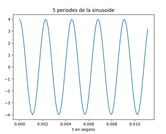
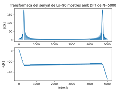

Primera tasca APA 2023: Anàlisi fitxer de so
============================================

Per llegir, escriure i representar un fitxer en format `*.wav` en python podem fem servir els següents mòduls:

- Numpy:
```python
	import numpy as np
```
- Matplotlib: 
```python
import matplotlib.pyplot as plt
```
- Soundfile:
```python
import soundfile as sf
```

Per **crear** i **guardar** a un fitxer un senyal sinusoidal de freqüència `fx Hz`, digitalitzat a `fm Hz`, de durada `T` segons i amplitud 
`A` fem:

```python
T= 2.5   	# Durada de T segons
fm=8000  	# freqüència de mostratge en Hz
fx=440  	# freqüència de la sinusoide
A=4	# amplitud de la sinusoide
pi=np.pi	# valor del número pi
L = int(fm * T)	# Nombre de mostres del senyal digital
Tm=1/fm  # període de mostratge
t=Tm*np.arange(L)  # Vector amb els valors de la variable temporal, de 0 a T
x = A * np.cos(2 * pi * fx * t)	# senyal sinusoidal
sf.write(‘so_exemple1.wav’, x, fm)	# escriptura del senyal a un fitxer en format wav
```

El resultat és un fitxer guardat al directori de treball i que es pot reproduir amb qualsevol reproductor d’àudio

Per **representar** gràficament 5 períodes de senyal fem:

```python
Tx=1/fx	# Període del senyal
Ls=int(fm*5*Tx)  # Nombre de mostres corresponents a 5 períodes de la sinusoide

plt.figure(0)   # nova figura
plt.plot(t[0:Ls], x[0:Ls])	# Representació del senyal en funció del temps
plt.xlabel("t en segons")	# etiqueta eix temporal
plt.title("5 periodes de la sinusoide")	# títol del gràfic
plt.show()	 # visualització de l’objecte gràfic. 
```

El resultat del gràfic és:



> Nota: Si es treballa amb ipython, es pot escriure %matplotlib i no cal posar el plt.show() per veure gràfics

El senyal es pot **escoltar (reproduir)** directament des de python important un entorn de treball amb els dispositius de so, com per 
exemple `sounddevice`:

```python
import sounddevice as sd
sd.play(x, fm)	# reproducció d’àudio
```

### Domini transformat

Domini transformat. Els senyals es poden analitzar en freqüència fent servir la Transformada Discreta de Fourier. 

La funció que incorpora el paquet `numpy` al submòdul `fft` és `fft`:

```python
from numpy.fft import fft		# importem la funció fft
N=5000	# Dimensió de la transformada discreta
X=fft(x[0:Ls],N)	# Càlcul de la transformada de 5 períodes de la sinusoide
```

I podem representar el mòdul i la fase, en funció de la posició de cada valor amb:

```python
k=np.arange(N)	# vector amb els valors 0≤  k<N

plt.figure(1)   # nova figura
plt.subplot(211)	#  espai per representar el mòdul
plt.plot(k,abs(X))	# representació del mòdul de la transformada
plt.title(f’Transformada del senyal de Ls={Ls} mostres amb DFT de N={N}’) # etiqueta del títol
plt.ylabel(‘|X[k]|’) # etiqueta de mòdul
plt.subplot(212)	#  espai per representar la fase
plt.plot(k,np.unwrap(np.angle(X)))	# representació de la fase de la transformad, desenroscada
plt.xlabel(‘Index k’)   # etiqueta de l’eix d’abscisses 
plt.ylabel(‘$\phi_x[k]$’)  # etiqueta de la fase en Latex
plt.show()		# Per mostrar els grafics
```



Proves i exercicis a fer i entregar
-----------------------------------


